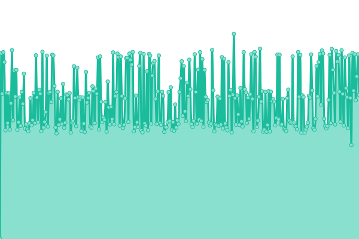
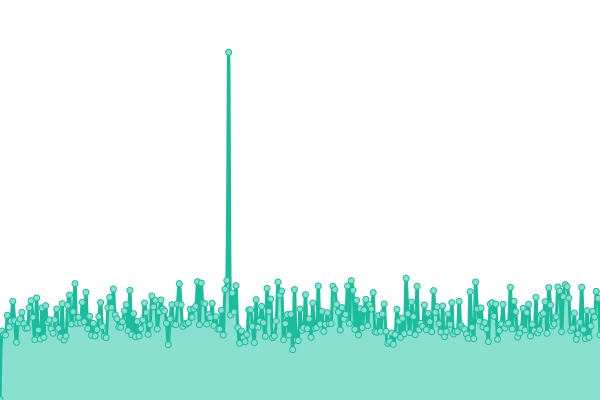
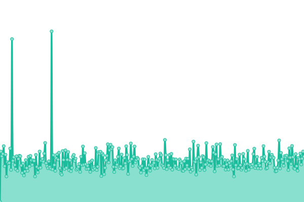
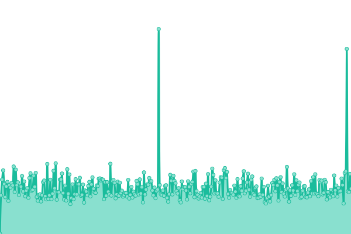

# [📈 Live Status](https://Ilger-Supporto.github.io/Uptime): <!--live status--> **🟧 Partial outage**

This repository contains the open-source uptime monitor and status page for [Ilger-Supporto](https://Ilger-Supporto.github.io/Uptime), powered by [Upptime](https://github.com/upptime/upptime).

With [Upptime](https://upptime.js.org), you can get your own unlimited and free uptime monitor and status page, powered entirely by a GitHub repository. We use [Issues](https://github.com/Ilger-Supporto/Uptime/issues) as incident reports, [Actions](https://github.com/Ilger-Supporto/Uptime/actions) as uptime monitors, and [Pages](https://Ilger-Supporto.github.io/Uptime) for the status page.

<!--start: status pages-->
<!-- This summary is generated by Upptime (https://github.com/upptime/upptime) -->
<!-- Do not edit this manually, your changes will be overwritten -->
<!-- prettier-ignore -->
| URL | Status | History | Response Time | Uptime |
| --- | ------ | ------- | ------------- | ------ |
|  Ilger | 🟩 Up | [ilger.yml](https://github.com/Ilger-Supporto/Uptime/commits/HEAD/history/ilger.yml) | 

 2597ms
     
 | 

<a href="https://Ilger-Supporto.github.io/Uptime/history/ilger">99.96%</a>
    

|  MTA1 | 🟩 Up | [mta-1.yml](https://github.com/Ilger-Supporto/Uptime/commits/HEAD/history/mta-1.yml) | 

 268ms
     
 | 

<a href="https://Ilger-Supporto.github.io/Uptime/history/mta-1">100.00%</a>
    

|  MTA2 | 🟩 Up | [mta-2.yml](https://github.com/Ilger-Supporto/Uptime/commits/HEAD/history/mta-2.yml) | 

 250ms
     
 | 

<a href="https://Ilger-Supporto.github.io/Uptime/history/mta-2">100.00%</a>
    

|  MTA3 | 🟩 Up | [mta-3.yml](https://github.com/Ilger-Supporto/Uptime/commits/HEAD/history/mta-3.yml) | 

 249ms
     
 | 

<a href="https://Ilger-Supporto.github.io/Uptime/history/mta-3">100.00%</a>
    

|  MTA4 | 🟩 Up | [mta-4.yml](https://github.com/Ilger-Supporto/Uptime/commits/HEAD/history/mta-4.yml) | 

 247ms
     
 | 

<a href="https://Ilger-Supporto.github.io/Uptime/history/mta-4">100.00%</a>
    

|  MTA5 | 🟩 Up | [mta-5.yml](https://github.com/Ilger-Supporto/Uptime/commits/HEAD/history/mta-5.yml) | 

 252ms
     
 | 

<a href="https://Ilger-Supporto.github.io/Uptime/history/mta-5">100.00%</a>
    

|  MTA6 | 🟩 Up | [mta-6.yml](https://github.com/Ilger-Supporto/Uptime/commits/HEAD/history/mta-6.yml) | 

 239ms
     
 | 

<a href="https://Ilger-Supporto.github.io/Uptime/history/mta-6">100.00%</a>
    

|  MTA7 | 🟩 Up | [mta-7.yml](https://github.com/Ilger-Supporto/Uptime/commits/HEAD/history/mta-7.yml) | 

 248ms
     
 | 

<a href="https://Ilger-Supporto.github.io/Uptime/history/mta-7">100.00%</a>
    

|  MTA8 | 🟩 Up | [mta-8.yml](https://github.com/Ilger-Supporto/Uptime/commits/HEAD/history/mta-8.yml) | 

 239ms
     
 | 

<a href="https://Ilger-Supporto.github.io/Uptime/history/mta-8">100.00%</a>
    

|  PRX1 | 🟩 Up | [prx-1.yml](https://github.com/Ilger-Supporto/Uptime/commits/HEAD/history/prx-1.yml) | 

 846ms
     
 | 

<a href="https://Ilger-Supporto.github.io/Uptime/history/prx-1">100.00%</a>
    

|  PRX2 | 🟩 Up | [prx-2.yml](https://github.com/Ilger-Supporto/Uptime/commits/HEAD/history/prx-2.yml) | 

 840ms
     
 | 

<a href="https://Ilger-Supporto.github.io/Uptime/history/prx-2">100.00%</a>
    

|  PRX3 | 🟩 Up | [prx-3.yml](https://github.com/Ilger-Supporto/Uptime/commits/HEAD/history/prx-3.yml) | 

 848ms
     
 | 

<a href="https://Ilger-Supporto.github.io/Uptime/history/prx-3">100.00%</a>
    

|  PRX4 | 🟩 Up | [prx-4.yml](https://github.com/Ilger-Supporto/Uptime/commits/HEAD/history/prx-4.yml) | 

 870ms
     
 | 

<a href="https://Ilger-Supporto.github.io/Uptime/history/prx-4">100.00%</a>
    

|  NEWS02_BIBLIO | 🟩 Up | [news-02-biblio.yml](https://github.com/Ilger-Supporto/Uptime/commits/HEAD/history/news-02-biblio.yml) | 

 1098ms
     
 | 

<a href="https://Ilger-Supporto.github.io/Uptime/history/news-02-biblio">99.83%</a>
    

|  MX8 | 🟩 Up | [mx-8.yml](https://github.com/Ilger-Supporto/Uptime/commits/HEAD/history/mx-8.yml) | 

 258ms
     
 | 

<a href="https://Ilger-Supporto.github.io/Uptime/history/mx-8">100.00%</a>
    

|  MX9 | 🟩 Up | [mx-9.yml](https://github.com/Ilger-Supporto/Uptime/commits/HEAD/history/mx-9.yml) | 

 255ms
     
 | 

<a href="https://Ilger-Supporto.github.io/Uptime/history/mx-9">21.22%</a>
    

|  MX10 | 🟩 Up | [mx-10.yml](https://github.com/Ilger-Supporto/Uptime/commits/HEAD/history/mx-10.yml) | 

 243ms
     
 | 

<a href="https://Ilger-Supporto.github.io/Uptime/history/mx-10">100.00%</a>
    

|  MX11 | 🟩 Up | [mx-11.yml](https://github.com/Ilger-Supporto/Uptime/commits/HEAD/history/mx-11.yml) | 

 248ms
     
 | 

<a href="https://Ilger-Supporto.github.io/Uptime/history/mx-11">99.80%</a>
    

|  MX12 | 🟩 Up | [mx-12.yml](https://github.com/Ilger-Supporto/Uptime/commits/HEAD/history/mx-12.yml) | 

 249ms
     
 | 

<a href="https://Ilger-Supporto.github.io/Uptime/history/mx-12">100.00%</a>
    

|  PRX_Z_1 | 🟩 Up | [prx-z-1.yml](https://github.com/Ilger-Supporto/Uptime/commits/HEAD/history/prx-z-1.yml) | 

 1135ms
     
 | 

<a href="https://Ilger-Supporto.github.io/Uptime/history/prx-z-1">100.00%</a>
    

|  PRX_Z_2 | 🟩 Up | [prx-z-2.yml](https://github.com/Ilger-Supporto/Uptime/commits/HEAD/history/prx-z-2.yml) | 

 1119ms
     
 | 

<a href="https://Ilger-Supporto.github.io/Uptime/history/prx-z-2">99.51%</a>
    

|  PRX_Z_3 | 🟩 Up | [prx-z-3.yml](https://github.com/Ilger-Supporto/Uptime/commits/HEAD/history/prx-z-3.yml) | 

 1267ms
     
 | 

<a href="https://Ilger-Supporto.github.io/Uptime/history/prx-z-3">100.00%</a>
    

|  PRX_Z_4 | 🟩 Up | [prx-z-4.yml](https://github.com/Ilger-Supporto/Uptime/commits/HEAD/history/prx-z-4.yml) | 

 1256ms
     
 | 

<a href="https://Ilger-Supporto.github.io/Uptime/history/prx-z-4">99.51%</a>
    

|  MTA2-DC | 🟩 Up | [mta-2-dc.yml](https://github.com/Ilger-Supporto/Uptime/commits/HEAD/history/mta-2-dc.yml) | 

 252ms
     
 | 

<a href="https://Ilger-Supporto.github.io/Uptime/history/mta-2-dc">54.29%</a>
    

|  MTA3-DC | 🟥 Down | [mta-3-dc.yml](https://github.com/Ilger-Supporto/Uptime/commits/HEAD/history/mta-3-dc.yml) | 

 222ms
     
 | 

<a href="https://Ilger-Supporto.github.io/Uptime/history/mta-3-dc">58.22%</a>
    

|  MTA4-DC | 🟩 Up | [mta-4-dc.yml](https://github.com/Ilger-Supporto/Uptime/commits/HEAD/history/mta-4-dc.yml) | 

 232ms
     
 | 

<a href="https://Ilger-Supporto.github.io/Uptime/history/mta-4-dc">54.20%</a>
    

|  KOS02 | 🟥 Down | [kos-02.yml](https://github.com/Ilger-Supporto/Uptime/commits/HEAD/history/kos-02.yml) | 

 0ms
     
 | 

<a href="https://Ilger-Supporto.github.io/Uptime/history/kos-02">97.24%</a>
    

|  EMAILIT02 | 🟩 Up | [emailit-02.yml](https://github.com/Ilger-Supporto/Uptime/commits/HEAD/history/emailit-02.yml) | 

 241ms
     
 | 

<a href="https://Ilger-Supporto.github.io/Uptime/history/emailit-02">100.00%</a>
    

|  SMTP3_QWEB | 🟥 Down | [smtp-3-qweb.yml](https://github.com/Ilger-Supporto/Uptime/commits/HEAD/history/smtp-3-qweb.yml) | 

 0ms
     
 | 

<a href="https://Ilger-Supporto.github.io/Uptime/history/smtp-3-qweb">97.30%</a>
    

|  SMTP2_ILGER | 🟩 Up | [smtp-2-ilger.yml](https://github.com/Ilger-Supporto/Uptime/commits/HEAD/history/smtp-2-ilger.yml) | 

 266ms
     
 | 

<a href="https://Ilger-Supporto.github.io/Uptime/history/smtp-2-ilger">100.00%</a>
    

|  SMTP3_ILGER | 🟩 Up | [smtp-3-ilger.yml](https://github.com/Ilger-Supporto/Uptime/commits/HEAD/history/smtp-3-ilger.yml) | 

 237ms
     
 | 

<a href="https://Ilger-Supporto.github.io/Uptime/history/smtp-3-ilger">100.00%</a>
    

|  SMTP4_ILGER | 🟩 Up | [smtp-4-ilger.yml](https://github.com/Ilger-Supporto/Uptime/commits/HEAD/history/smtp-4-ilger.yml) | 

 243ms
     
 | 

<a href="https://Ilger-Supporto.github.io/Uptime/history/smtp-4-ilger">100.00%</a>
    

|  SMTP5_ILGER | 🟩 Up | [smtp-5-ilger.yml](https://github.com/Ilger-Supporto/Uptime/commits/HEAD/history/smtp-5-ilger.yml) | 

 251ms
     
 | 

<a href="https://Ilger-Supporto.github.io/Uptime/history/smtp-5-ilger">100.00%</a>
    

|  SMTP6_ILGER | 🟩 Up | [smtp-6-ilger.yml](https://github.com/Ilger-Supporto/Uptime/commits/HEAD/history/smtp-6-ilger.yml) | 

 213ms
     
 | 

<a href="https://Ilger-Supporto.github.io/Uptime/history/smtp-6-ilger">100.00%</a>
    

|  SMTPMEDICASA | 🟩 Up | [smtpmedicasa.yml](https://github.com/Ilger-Supporto/Uptime/commits/HEAD/history/smtpmedicasa.yml) | 

 231ms
     
 | 

<a href="https://Ilger-Supporto.github.io/Uptime/history/smtpmedicasa">100.00%</a>
    

|  SMTP7_ILGER | 🟩 Up | [smtp-7-ilger.yml](https://github.com/Ilger-Supporto/Uptime/commits/HEAD/history/smtp-7-ilger.yml) | 

 249ms
     
 | 

<a href="https://Ilger-Supporto.github.io/Uptime/history/smtp-7-ilger">100.00%</a>
    

|  SMTP8_ILGER | 🟩 Up | [smtp-8-ilger.yml](https://github.com/Ilger-Supporto/Uptime/commits/HEAD/history/smtp-8-ilger.yml) | 

 238ms
     
 | 

<a href="https://Ilger-Supporto.github.io/Uptime/history/smtp-8-ilger">100.00%</a>
    

|  SMTP9_ILGER | 🟩 Up | [smtp-9-ilger.yml](https://github.com/Ilger-Supporto/Uptime/commits/HEAD/history/smtp-9-ilger.yml) | 

 240ms
     
 | 

<a href="https://Ilger-Supporto.github.io/Uptime/history/smtp-9-ilger">100.00%</a>
    

|  SMTP10_ILGER | 🟩 Up | [smtp-10-ilger.yml](https://github.com/Ilger-Supporto/Uptime/commits/HEAD/history/smtp-10-ilger.yml) | 

 233ms
     
 | 

<a href="https://Ilger-Supporto.github.io/Uptime/history/smtp-10-ilger">100.00%</a>
    

|  SMTP11_ILGER | 🟩 Up | [smtp-11-ilger.yml](https://github.com/Ilger-Supporto/Uptime/commits/HEAD/history/smtp-11-ilger.yml) | 

 250ms
     
 | 

<a href="https://Ilger-Supporto.github.io/Uptime/history/smtp-11-ilger">100.00%</a>
    

|  PRX_2_DC | 🟩 Up | [prx-2-dc.yml](https://github.com/Ilger-Supporto/Uptime/commits/HEAD/history/prx-2-dc.yml) | 

 890ms
     
 | 

<a href="https://Ilger-Supporto.github.io/Uptime/history/prx-2-dc">100.00%</a>
    

|  PRX_3_DC | 🟩 Up | [prx-3-dc.yml](https://github.com/Ilger-Supporto/Uptime/commits/HEAD/history/prx-3-dc.yml) | 

 885ms
     
 | 

<a href="https://Ilger-Supporto.github.io/Uptime/history/prx-3-dc">100.00%</a>
    

|  MX3 | 🟩 Up | [mx-3.yml](https://github.com/Ilger-Supporto/Uptime/commits/HEAD/history/mx-3.yml) | 

 977ms
     
 | 

<a href="https://Ilger-Supporto.github.io/Uptime/history/mx-3">100.00%</a>
    

|  MX2 | 🟩 Up | [mx-2.yml](https://github.com/Ilger-Supporto/Uptime/commits/HEAD/history/mx-2.yml) | 

 775ms
     
 | 

<a href="https://Ilger-Supporto.github.io/Uptime/history/mx-2">100.00%</a>
    

|  OPEN12 | 🟩 Up | [open-12.yml](https://github.com/Ilger-Supporto/Uptime/commits/HEAD/history/open-12.yml) | 

 860ms
     
 | 

<a href="https://Ilger-Supporto.github.io/Uptime/history/open-12">100.00%</a>
    

|  Z_POLARIS | 🟩 Up | [z-polaris.yml](https://github.com/Ilger-Supporto/Uptime/commits/HEAD/history/z-polaris.yml) | 

 929ms
     
 | 

<a href="https://Ilger-Supporto.github.io/Uptime/history/z-polaris">100.00%</a>
    

|  POSTA_ZEUS | 🟩 Up | [posta-zeus.yml](https://github.com/Ilger-Supporto/Uptime/commits/HEAD/history/posta-zeus.yml) | 

 929ms
     
 | 

<a href="https://Ilger-Supporto.github.io/Uptime/history/posta-zeus">100.00%</a>
    

|  SPIDER4WEB | 🟩 Up | [spider-4-web.yml](https://github.com/Ilger-Supporto/Uptime/commits/HEAD/history/spider-4-web.yml) | 

 1408ms
     
 | 

<a href="https://Ilger-Supporto.github.io/Uptime/history/spider-4-web">100.00%</a>
    

|  BBMNET | 🟩 Up | [bbmnet.yml](https://github.com/Ilger-Supporto/Uptime/commits/HEAD/history/bbmnet.yml) | 

 2115ms
     
 | 

<a href="https://Ilger-Supporto.github.io/Uptime/history/bbmnet">100.00%</a>
    

|  Z02_CASACURA | 🟩 Up | [z02-casacura.yml](https://github.com/Ilger-Supporto/Uptime/commits/HEAD/history/z02-casacura.yml) | 

 969ms
     
 | 

<a href="https://Ilger-Supporto.github.io/Uptime/history/z02-casacura">100.00%</a>
    

<!--end: status pages-->

[**Visit our status website →**](https://Ilger-Supporto.github.io/Uptime)

## 📄 License

- Powered by: [Upptime](https://github.com/upptime/upptime)
- Code: [MIT](./LICENSE) © [Ilger-Supporto](https://Ilger-Supporto.github.io/Uptime)
- Data in the `./history` directory: [Open Database License](https://opendatacommons.org/licenses/odbl/1-0/)
