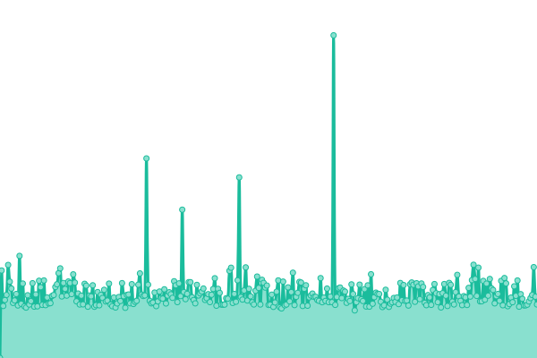
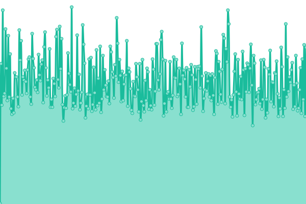
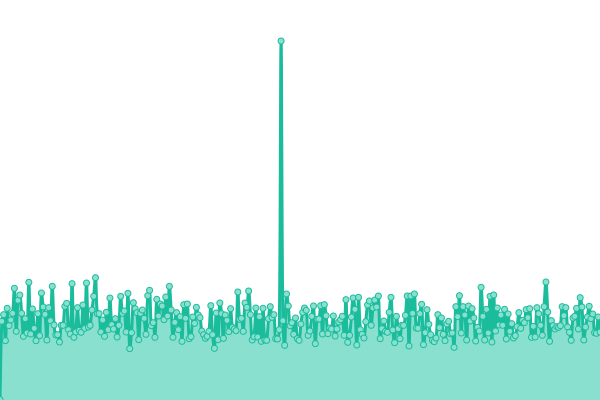
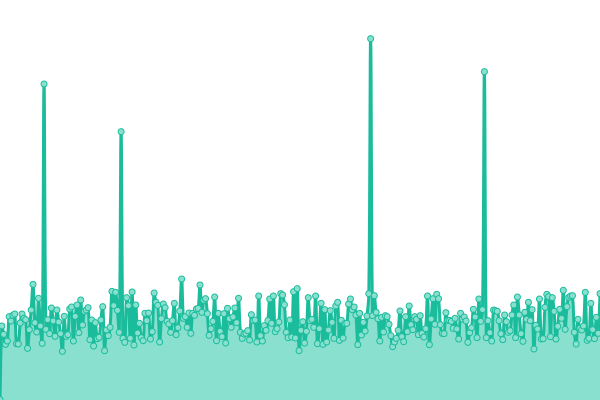
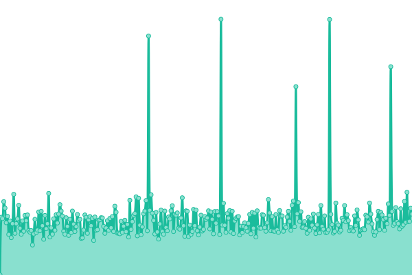
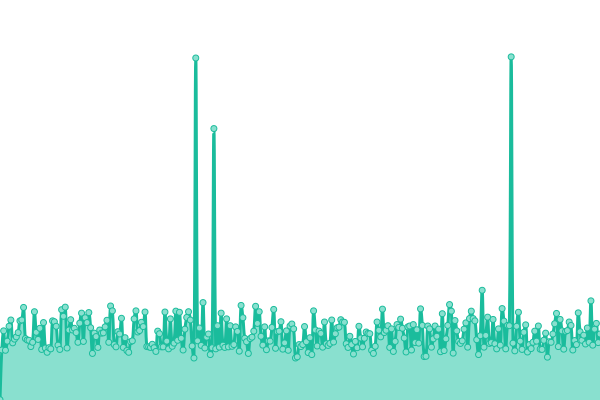

# [📈 Live Status](https://Ilger-Supporto.github.io/Uptime): <!--live status--> **🟧 Partial outage**

This repository contains the open-source uptime monitor and status page for [Ilger-Supporto](https://Ilger-Supporto.github.io/Uptime), powered by [Upptime](https://github.com/upptime/upptime).

With [Upptime](https://upptime.js.org), you can get your own unlimited and free uptime monitor and status page, powered entirely by a GitHub repository. We use [Issues](https://github.com/Ilger-Supporto/Uptime/issues) as incident reports, [Actions](https://github.com/Ilger-Supporto/Uptime/actions) as uptime monitors, and [Pages](https://Ilger-Supporto.github.io/Uptime) for the status page.

<!--start: status pages-->
<!-- This summary is generated by Upptime (https://github.com/upptime/upptime) -->
<!-- Do not edit this manually, your changes will be overwritten -->
<!-- prettier-ignore -->
| URL | Status | History | Response Time | Uptime |
| --- | ------ | ------- | ------------- | ------ |
|  Ilger | 🟩 Up | [ilger.yml](https://github.com/Ilger-Supporto/Uptime/commits/HEAD/history/ilger.yml) | 

 1346ms
     
 | 

<a href="https://Ilger-Supporto.github.io/Uptime/history/ilger">100.00%</a>
    

|  MTA1 | 🟩 Up | [mta-1.yml](https://github.com/Ilger-Supporto/Uptime/commits/HEAD/history/mta-1.yml) | 

 201ms
     
 | 

<a href="https://Ilger-Supporto.github.io/Uptime/history/mta-1">100.00%</a>
    

|  MTA2 | 🟩 Up | [mta-2.yml](https://github.com/Ilger-Supporto/Uptime/commits/HEAD/history/mta-2.yml) | 

 202ms
     
 | 

<a href="https://Ilger-Supporto.github.io/Uptime/history/mta-2">100.00%</a>
    

|  MTA3 | 🟩 Up | [mta-3.yml](https://github.com/Ilger-Supporto/Uptime/commits/HEAD/history/mta-3.yml) | 

 224ms
     
 | 

<a href="https://Ilger-Supporto.github.io/Uptime/history/mta-3">100.00%</a>
    

|  MTA4 | 🟩 Up | [mta-4.yml](https://github.com/Ilger-Supporto/Uptime/commits/HEAD/history/mta-4.yml) | 

 189ms
     
 | 

<a href="https://Ilger-Supporto.github.io/Uptime/history/mta-4">100.00%</a>
    

|  MTA5 | 🟩 Up | [mta-5.yml](https://github.com/Ilger-Supporto/Uptime/commits/HEAD/history/mta-5.yml) | 

 267ms
     
 | 

<a href="https://Ilger-Supporto.github.io/Uptime/history/mta-5">100.00%</a>
    

|  MTA6 | 🟩 Up | [mta-6.yml](https://github.com/Ilger-Supporto/Uptime/commits/HEAD/history/mta-6.yml) | 

 273ms
     
 | 

<a href="https://Ilger-Supporto.github.io/Uptime/history/mta-6">100.00%</a>
    

|  MTA7 | 🟩 Up | [mta-7.yml](https://github.com/Ilger-Supporto/Uptime/commits/HEAD/history/mta-7.yml) | 

 196ms
     
 | 

<a href="https://Ilger-Supporto.github.io/Uptime/history/mta-7">100.00%</a>
    

|  MTA8 | 🟩 Up | [mta-8.yml](https://github.com/Ilger-Supporto/Uptime/commits/HEAD/history/mta-8.yml) | 

 192ms
     
 | 

<a href="https://Ilger-Supporto.github.io/Uptime/history/mta-8">100.00%</a>
    

|  PRX1-3 | 🟥 Down | [prx-1-3.yml](https://github.com/Ilger-Supporto/Uptime/commits/HEAD/history/prx-1-3.yml) | 

 0ms
     
 | 

<a href="https://Ilger-Supporto.github.io/Uptime/history/prx-1-3">0.06%</a>
    

|  PRX2-4 | 🟥 Down | [prx-2-4.yml](https://github.com/Ilger-Supporto/Uptime/commits/HEAD/history/prx-2-4.yml) | 

 0ms
     
 | 

<a href="https://Ilger-Supporto.github.io/Uptime/history/prx-2-4">0.02%</a>
    

<!--end: status pages-->

[**Visit our status website →**](https://Ilger-Supporto.github.io/Uptime)

## 📄 License

- Powered by: [Upptime](https://github.com/upptime/upptime)
- Code: [MIT](./LICENSE) © [Ilger-Supporto](https://Ilger-Supporto.github.io/Uptime)
- Data in the `./history` directory: [Open Database License](https://opendatacommons.org/licenses/odbl/1-0/)
